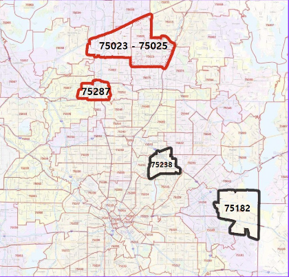

# WR Investments  
---  

Goldman Sachs recently purhcased 87 homes in Florida. We were hired by Goldman to offer our services and help them chose which zip code is best for their next investment.  


*Austin, TX*  


---
## Study Authors  

**Rishi Ahuja**  
  

**Woojin Jun**  


---
## Business understanding  

Stakeholder: Goldman Sachs 
Business Problem: Reccomend to Goldman Sachs where they should invest in their next large home purchase. 

Our goal is to inform Goldman on which city to invest in. We settled on Texas because Texas' house prices are lower than the national average. 


We decided to focus on the House Prices during the Subprime Morgage Crisis of 2007-2010

---  
## Data understanding  

The analysis data was provided by Zillow and included data from 1996 to 2018. The dataset included information about 15,000 zip codes and after data cleaning, we used 1,000 data points.  Our main Target Predictor the data from October 2007 to November 2011. 


 The goal of the project was to pick a region of the country and determine what the “5 best zip codes for investment” would be for Goldman.  We narrowed it down to Texas but then had to determine what zip code is the most stable. We decided on seeing what had the least drop in price during the SubPrime Morgage Crisis. As you see below these Zip Code's in Dallas were the best.   


---


---
## Models  

After narrowing down our zipcodes to invest, we used ARIMA model to predict and forecast future house prices. Root mean square error was 75,698 dollars and has 51% accuracy But still the prediction model and the actual price both rise, we can regard this as buying signal. 


As shown in the previous map, moving average also predicts that northern suburb has high chance and high percentage increasing of house price.


---


---
## Recommendations  

Based on our data, our main findings were the following zip codes. :  


---
## Next Steps  

We recommend 3 different areas in which to concentrate for future study and analysis.  

1. Exploring recent house price changes and see how that affects our model.   

2. Study and explore the impact on the change in the Federal Interest Rate  

3. Explore the change in government policy on large corporations buying houses.   


```